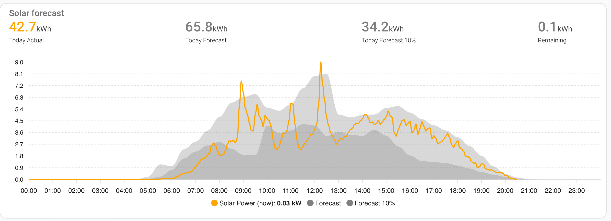

# HA Solcast PV Solar Forecast Integration

[](https://github.com/hacs/integration)
<!--[](https://github.com/custom-components/hacs)-->


> [!WARNING]  
> This repository is **not** currently in HACS, so cannot yet be searched for there.  While [this PR](https://github.com/hacs/default/pull/2535) remains open, you must install manually using the [Manually in HACS](#manually-in-hacs) instructions below: 

> [!NOTE]
> The use of beta versions can be a simple way to fix issues. Check the releases at https://github.com/BJReplay/ha-solcast-solar/releases to see if an issue has already been resolved. If so, turn ```Show beta versions``` on when re-downloading from HACS. Your feedback from testing betas will be most welcome in the repository discussions. https://github.com/BJReplay/ha-solcast-solar/discussions.

> [!IMPORTANT]  
> This repository may only be sporadically maintained.  Breaking API changes from Solcast will be maintained on a best efforts basis.
>
> Collaborators are welcome, as are PRs for enhancements.
>
> Bug reports unrelated to API changes may not get the attention you want, as the repository owner is largely retired for medical reasons, but knows the Solcast API as a former user in this and other projects.

> [!NOTE]
> This integration can be used as a replacement for the oziee/ha-solcast-solar integration, which has been removed from GitHub and HACS.  
>
> Uninstalling the Oziee version then installing this one will preserve the history and configuration from that prior integration.

Version Change Notes: See [below](#changes).

Home Assistant (https://www.home-assistant.io) Integration Component

This custom component integrates the Solcast Hobby PV Forecast API into Home Assistant.

[](https://user-images.githubusercontent.com/1471841/135556872-ff5b51ac-699e-4ea5-869c-f9b0d0c5b815.png)

> [!NOTE]  
> Solcast have altered their API limits for new account creators
>
> Solcast now only offer new account creators 10 API calls per day (used to be 50). 
> Old account users still have 50 API calls.
> 
> The integration currently no longer includes auto API polling. Users now need to create their own automations to call the update solcast service to poll for new data. Keep in mind your API poll limit.

## Solcast Requirements:
Sign up for an API key (https://solcast.com/).

> Solcast may take up to 24hrs to create the account.

Copy the API Key for use with this integration (See [Configuration](#Configuration) below).

## Installation

### HACS *(recommended)*

Using HACS. More info [here](https://hacs.xyz/)  

[](https://my.home-assistant.io/redirect/hacs_repository/?owner=BJReplay&repository=ha-solcast-solar&category=integration)

#### Manually in HACS  

More info [here](https://hacs.xyz/docs/faq/custom_repositories/)

1. (If using it, remove oziee/ha-solcast-solar in HACS)
1. Add custom repository (three verical dots menu, top right) ```https://github.com/BJReplay/ha-solcast-solar``` as an ```integration```
1. Search for 'Solcast' in HACS, open it and click the ```Download``` button
1. See [Configuration](#configuration) below

If previously using Oziee's ha-solcast-solar then all history and config should remain.

<summary><h3>Manually</summary></h3>

You probably **do not** want to do this! Use the HACS method above unless you know what you are doing and have a good reason as to why you are installing manually.

1. Using the tool of choice open the directory (folder) for your HA configuration (where you find ```configuration.yaml```)
1. If you do not have a ```custom_components``` directory there, you need to create it
1. In the ```custom_components``` directory create a new folder called ```solcast_solar```
1. Download _all_ the files from the ```custom_components/solcast_solar/``` directory in this repository
1. Place the files you downloaded in the new directory you created
1. *Restart HA to load the new integration*
1. See [Configuration](#configuration) below

## Configuration

1. [Click Here](https://my.home-assistant.io/redirect/config_flow_start/?domain=solcast_solar) to directly add a `Solcast Solar` integration **or**<br/>
 a. In Home Assistant, go to Settings -> [Integrations](https://my.home-assistant.io/redirect/integrations/)<br/>
 b. Click `+ Add Integrations` and select `Solcast PV Forecast`<br/>
1. Enter your `Solcast API Key`
1. Click `Submit`

* Create your own [automation](#services) to call the service `solcast_solar.update_forecasts` when you would like to update the Solar forecast within Home Assistant.

* Change the configuration options for an existing `Solcast PV Forecast` integration in the Home Assistant Integrations by selecting Solcast then `Configure` (cog wheel).

* If you have more than one Solcast account because you have more than 2 rooftop setups, enter both account API keys separated by a comma `xxxxxxxx-xxxxx-xxxx,yyyyyyyy-yyyyy-yyyy` (_NB: this goes against Solcast T&C's by having more than one account_).

* Make sure you enter your `API Key` not your rooftop id created in Solcast. You can find your API key here [api key](https://toolkit.solcast.com.au/account).

[](https://github.com/BJReplay/ha-solcast-solar/blob/v3/.github/SCREENSHOTS/install.png)

> [!IMPORTANT]
> After the integration is started, review the Home Assistant log.
> 
> Should an error that gathering rooftop sites data has failed occur then this is not an integration issue, rather a Solcast API issue. The best course of action is to restart the integration, or Home Assistant entirely, and monitor until the sites data can be acquired. Until rooftop sites data is acquired the integration cannot function.
>
> The integration does attempt retries when the Solcast API is busy, but sometimes even this does not help.

## Dampening Configuration

New in v4.0.8 is the option to configure hourly dampening values.

[](https://github.com/BJReplay/ha-solcast-solar/blob/v3/.github/SCREENSHOTS/reconfig.png)

[](https://github.com/BJReplay/ha-solcast-solar/blob/v3/.github/SCREENSHOTS/damp.png)

Here you can change the dampening factor value for any hour. Values from 0.0 - 1.0 are valid. Setting 0.95 will dampen each Solcast forecast data value by 5%. This is reflected in the sensor values and attributes and also in the Home Assistant Energy dashboard.

[](https://github.com/BJReplay/ha-solcast-solar/blob/v3/.github/SCREENSHOTS/dampopt.png)

## Key Solcast concepts

Solcast will produce a forecast of your solar PV generation for today, tomorrow, the day after (day 3), ... up to day 7.
Each of these forecasts will be in a separate sensor (see below) and the sensor value will be the total predicted solar generation for your Solcast account for each day.
Separate sensors contain peak solar generation power, peak solar generation time, and various forecasts of next hour, 30 minutes, etc.

If you have multiple arrays on different roof orientations, these can be configured in Solcast as separate 'sites' with differing azimuth, tilt and generation, to a maximum of two sites for a free hobbyist account.

Three solar PV generation estimates are produced by the Solcast integration:
- 'central' or 50% or most likely to occur PV forecast (or the `forecast`),
- '10%' or 1 in 10 'worst case' PV forecast assuming more cloud coverage (`forecast10`)
- '90%' or 1 in 10 'best case' PV forecast assuming less cloud coverage (`forecast90`)

The detail of these different forecast estimates can be found in sensor attributes, broken down by 30 minute and hourly invervals across the day. Separate attributes sum the different estimates for each day.

## Services
These are the services for this integration: ([Configuration](#configuration))

| Service | Action |
| --- | --- |
| `solcast_solar.update_forecasts` | Updates the future forecast data only |
| `solcast_solar.clear_all_solcast_data` | Deletes the `solcast.json` cached file |
| `solcast_solar.query_forecast_data` | Returns a list of forecast data using a datetime range start - end |
| `solcast_solar.set_dampening` | Updates the hourly dampening factors |
| `solcast_solar.set_hard_limit` | Set inverter forecast hard limit |
| `solcast_solar.remove_hard_limit` | Remove inverter forecast hard limit |

### Basic HA Automation to poll Solcast API data
Create a new automation and setup your prefered trigger times to poll for new Solcast forecast data.  
These are examples, so alter these or create your own to fit your own needs.

**Recommended**

To make the most of the available API calls, you can have the automation call the API using an interval calculated by the number of daytime hours divided by the number of total API calls a day you can make.

This automation bases execution times on sunrise and sunset, which differ around the globe, so inherently spreads the load on Solcast. It also incorporates a randomised time offset. This will hopefully avoid the likelihood that the Solcast servers get inundated by multiple callers at the same time.

```yaml
alias: Solcast update
description: ""
trigger:
  - platform: template
    value_template: >-
      
      
      
      
         
      
      
      
      
      
        
        
          
        
      
      {{ ns.match }}
condition:
  - condition: sun
    before: sunset
    after: sunrise
action:
  - delay:
      seconds: "{{ range(30, 360)|random|int }}"
  - service: solcast_solar.update_forecasts
    data: {}
mode: single
```

> [!NOTE]  
> If you have two arrays on your roof then 2 api calls will be made for each update, effectively reducing the number of updates to 5 per day. For this case, change to: `api_request_limit = 5`

The next automation also includes a rendomisation so that calls aren't made at precisely the same time, hopefully avoiding the likelihood that the Solcast servers are inundated by multiple calls at the same time, but it triggers every four hours between sunrise and sunset:

```yaml
alias: Solcast_update
description: New API call Solcast
trigger:
 - platform: time_pattern
   hours: /4
condition:
 - condition: sun
   before: sunset
   after: sunrise
action:
 - delay:
     seconds: "{{ range(30, 360)|random|int }}"
 - service: solcast_solar.update_forecasts
   data: {}
mode: single
```

The next automation triggers at 4am, 10am and 4pm, with a random delay.

```yaml
alias: Solcast update
description: ""
trigger:
  - platform: time
    at: "4:00:00"
  - platform: time
    at: "10:00:00"
  - platform: time
    at: "16:00:00"
condition: []
action:
  - delay:
      seconds: "{{ range(30, 360)|random|int }}"
  - service: solcast_solar.update_forecasts
    data: {}
mode: single
```

> [!TIP]
> The Solcast Servers seem to occasionally be under some strain, and the servers return 429 return codes when they are busy.
> The Solcast integration will automatically pause, then retry the connection several times, but occasionally even this strategy can fail to download Solcast data.
> Changing your API Key is not a solution, nor is uninstalling and re-installing the Solcast PV Solar Integration.
> These "tricks" might appear to work, but all that has actually happened is that you have tried again later, and the integration has worked as the Solcast servers are less busy.
> 
> If you think that have problems in the integration, make sure that you have logging turned on, and capture logs to find out if you are getting messages indicating that the Solcast API is busy - these indicate that the Solcast API is under stress.
> Log capture instructions are in the Bug Issue Template - you will see them if you start creating a new issue - make sure you include logs if you want the assistance of the repository constributors.
> An example of busy messages and a retry are shown below.

```
homeassistant  | 2024-06-17 09:34:22.403 DEBUG (MainThread) [custom_components.solcast_solar.solcastapi] SOLCAST - API polling for rooftop 1234-5678-9012-3456
homeassistant  | 2024-06-17 09:34:22.403 DEBUG (MainThread) [custom_components.solcast_solar.solcastapi] SOLCAST - Polling API for rooftop_id 1234-5678-9012-3456
homeassistant  | 2024-06-17 09:34:22.403 DEBUG (MainThread) [custom_components.solcast_solar.solcastapi] SOLCAST - fetch_data code url - https://api.solcast.com.au/rooftop_sites/1234-5678-9012-3456/forecasts
homeassistant  | 2024-06-17 09:34:22.403 DEBUG (MainThread) [custom_components.solcast_solar.solcastapi] SOLCAST - Fetching forecast
homeassistant  | 2024-06-17 09:34:22.549 DEBUG (MainThread) [custom_components.solcast_solar.solcastapi] SOLCAST - Solcast API is busy, pausing 55 seconds before retry
homeassistant  | 2024-06-17 09:35:17.552 DEBUG (MainThread) [custom_components.solcast_solar.solcastapi] SOLCAST - Fetching forecast
homeassistant  | 2024-06-17 09:35:18.065 DEBUG (MainThread) [custom_components.solcast_solar.solcastapi] SOLCAST - API returned data. API Counter incremented from 35 to 36
homeassistant  | 2024-06-17 09:35:18.065 DEBUG (MainThread) [custom_components.solcast_solar.solcastapi] SOLCAST - writing usage cache
homeassistant  | 2024-06-17 09:35:18.089 DEBUG (MainThread) [custom_components.solcast_solar.solcastapi] SOLCAST - fetch_data code http_session returned data type is <class 'dict'>
homeassistant  | 2024-06-17 09:35:18.090 DEBUG (MainThread) [custom_components.solcast_solar.solcastapi] SOLCAST - fetch_data code http_session status is 200
```

<summary><h3>Set up HA Energy Dashboard settings</summary></h3>

Go to the `HA>Settings>Dashboards>Energy`

Click the 'edit the Solar Production' item you have previously created in the Energy dashboard. 

> [!IMPORTANT]  
> If you do not have a solar generation sensor in your system then this integration will not work in the Energy dashboard. The graph, and adding the forecast integration rely on there being a generation sensor setup.

[](https://user-images.githubusercontent.com/1471841/149643349-d776f1ad-530c-46aa-91dc-8b9e7c7f3123.png)

Click the Forecast option button and select the Solcast Solar option.. Click SAVE.. HA will do all the rest for you.

[](https://user-images.githubusercontent.com/1471841/174471543-0833b141-0c97-4b90-a058-cf986e89bbce.png)

## HA Views:

<summary><h3>HA Energy Tab</summary></h3>

[](https://user-images.githubusercontent.com/1471841/135556872-ff5b51ac-699e-4ea5-869c-f9b0d0c5b815.png)

<summary><h3>Sensors</summary></h3>

| Name | Type | Attributes | Unit | Description |
| ------------------------------ | ----------- | ----------- | ----------- | -------------------------------------------------------------------------------------------------------------------------------------------------------------------------------------------------------------------------------------------------------------------------------------------------------------------------------------------- | 
| `Today` | number | Y | `kWh` | Total forecast solar production for today |
| `Tomorrow` | number | Y | `kWh` | Total forecast solar production for day + 1 (tomorrow) |
| `D3` | number | Y | `kWh` | Total forecast solar production for day + 2 (day 3) |
| `D4` | number | Y | `kWh` | Total forecast solar production for day + 3 (day 4) |
| `D5` | number | Y | `kWh` | Total forecast solar production for day + 4 (day 5) |
| `D6` | number | Y | `kWh`| Total forecast solar production for day + 5 (day 6) |
| `D7` | number | Y | `kWh` | Total forecast solar production for day + 6 (day 7) |
| `This Hour` | number | Y | `Wh` | Forecasted solar production current hour (attributes contain site breakdown) |
| `Next Hour` | number | Y | `Wh` | Forecasted solar production next hour (attributes contain site breakdown) |
| `Forecast Next X Hours` | number | Y | `Wh` | Custom user defined X hour forecast |
| `Remaining Today` | number | Y | `kWh` | Predicted remaining solar production today |
| `Peak Forecast Today` | number | Y | `W` | Highest predicted production within an hour period today (attributes contain site breakdown) |
| `Peak Time Today` | date/time | Y |  | Hour of max forecasted production of solar today (attributes contain site breakdown) |
| `Peak Forecast Tomorrow` | number | Y | `W` | Highest predicted production within an hour period tomorrow (attributes contain site breakdown) |
| `Peak Time Tomorrow` | date/time | Y |  | Hour of max forecasted production of solar tomorrow (attributes contain site breakdown) |
| `Power Now` | number | Y | `W` | Power forecast during the current 0-30 / 30-59 min hour period (attributes contain site breakdown) |
| `Power Next 30 Mins` | number | Y | `W` | Power forecast for the next 30 min block period (attributes contain site breakdown) |
| `Power Next Hour` | number | Y | `W` | Power forecast for the next block 60 min from now (attributes contain site breakdown) |

> [!NOTE]
> Where a site breakdown is available as an attribute, the attribute name is the Solcast site resource ID.
>
> Most sensors also include an attribute for `estimate`, `estimate10` and `estimate90`. Template sensors may be created to expose their value, or the `state_attr()` can be used directly in automations.
>
> Access these in a template sensor or automation using something like:
>
> ```
> {{ state_attr('sensor.solcast_pv_forecast_peak_forecast_today', '1234-5678-9012-3456') | float(0) }}
> {{ state_attr('sensor.solcast_pv_forecast_peak_forecast_today', 'estimate10') | float(0) }}
> {{ state_attr('sensor.solcast_pv_forecast_peak_forecast_today', 'estimate10-1234-5678-9012-3456') | float(0) }}
> ```

> [!NOTE]
> The values for `Next Hour` and `Forecast Next X Hours` may be different if the custom X hour setting is 1. This has a simple explanation.
>
> They are calculated using a different start and end time. One is from the start of this hour, i.e. in the past, e.g. 14:00:00 to 15:00:00. The custom is from now(), e.g. 14:21:19 to 15:21:19.
>
> This will likely yield a different result, depending on the time the value is requested, so it is not wrong. It's just different.

### Configuration

| Name | Type | Attributes | Unit | Description |
| ------------------------------ | ----------- | ----------- | ----------- | -------------------------------------------------------------------------------------------------------------------------------------------------------------------------------------------------------------------------------------------------------------------------------------------------------------------------------------------- | 
| `Forecast Field` | selector | N |  | Selector to select the Solcast value field for calculations either 'estimate', 'estimate10' or 'estimate90' |

### Diagnostic

| Name | Type | Attributes | Unit | Description |
| ------------------------------ | ----------- | ----------- | ----------- | -------------------------------------------------------------------------------------------------------------------------------------------------------------------------------------------------------------------------------------------------------------------------------------------------------------------------------------------- | 
| `API Last Polled` | date/time | N |  | Date/time when the API data was polled |
| `API Limit` | number | N | `integer` | Total times the API can been called in a 24 hour period[^1] |
| `API used` | number | N | `integer` | Total times the API has been called today (API counter resets to zero at midnight UTC)[^1] |  
| `Hard Limit Set` |  | N |  | `False` is not set, else set integer value in `watts`. Can only be set or removed by service ([services](#services))|
| `Rooftop(s) name` | number | Y | `kWh` | Total forecast for rooftop today (attributes contain the solcast rooftop setup)[^2] |

[^1]: API usage information is directly read from Solcast
[^2]: Each rooftop created in Solcast will be listed separately

### Sample PV Graph

The following YAML produces a graph of today's PV generation, PV forecast and PV10 forecast. Requires [Apex Charts](https://github.com/RomRider/apexcharts-card) to be installed.

[](https://github.com/BJReplay/ha-solcast-solar/blob/v3/.github/SCREENSHOTS/forecast_today.png)

Customise with appropriate Home Assistant sensors for today's total solar generation and solar panel PV power output.

```yaml
type: custom:apexcharts-card
header:
  title: Solar forecast
  show: true
  show_states: true
  colorize_states: true
apex_config:
  chart:
    height: 300px
  tooltip:
    enabled: true
    shared: true
    followCursor: true
graph_span: 24h
span:
  start: day
yaxis:
  - id: capacity
    show: true
    opposite: true
    decimals: 0
    max: 100
    min: 0
    apex_config:
      tickAmount: 10
  - id: kWh
    show: true
    min: 0
    apex_config:
      tickAmount: 10
  - id: header_only
    show: false
series:
  - entity: sensor.SOLAR_POWER
    name: Solar Power (now)
    type: line
    stroke_width: 2
    float_precision: 2
    color: Orange
    yaxis_id: kWh
    unit: kW
    extend_to: now
    show:
      legend_value: true
      in_header: false
    group_by:
      func: avg
      duration: 5m
  - entity: sensor.solcast_pv_forecast_forecast_today
    name: Forecast
    color: Grey
    opacity: 0.3
    stroke_width: 0
    type: area
    extend_to: false
    yaxis_id: kWh
    show:
      legend_value: false
      in_header: false
    data_generator: |
      return entity.attributes.detailedForecast.map((entry) => {
            return [new Date(entry.period_start), entry.pv_estimate];
          });
  - entity: sensor.solcast_pv_forecast_forecast_today
    name: Forecast 10%
    color: Grey
    opacity: 0.3
    stroke_width: 0
    type: area
    extend_to: false
    yaxis_id: kWh
    show:
      legend_value: false
      in_header: false
    data_generator: |
      return entity.attributes.detailedForecast.map((entry) => {
            return [new Date(entry.period_start), entry.pv_estimate10];
          });
  - entity: sensor.SOLAR_GENERATION_ENERGY_TODAY
    yaxis_id: header_only
    name: Today Actual
    stroke_width: 2
    color: Orange
    show:
      legend_value: true
      in_header: true
      in_chart: false
  - entity: sensor.solcast_pv_forecast_forecast_today
    yaxis_id: header_only
    name: Today Forecast
    color: Grey
    show:
      legend_value: true
      in_header: true
      in_chart: false
  - entity: sensor.solcast_pv_forecast_forecast_today
    attribute: estimate10
    yaxis_id: header_only
    name: Today Forecast 10%
    color: Grey
    opacity: 0.3
    show:
      legend_value: true
      in_header: true
      in_chart: false
  - entity: sensor.solcast_pv_forecast_forecast_remaining_today
    yaxis_id: header_only
    name: Remaining
    color: Grey
    show:
      legend_value: true
      in_header: true
      in_chart: false
```

<summary><h3>Credits</summary></h3>

Modified from the great works of
* oziee/ha-solcast-solar
* @rany2 - ranygh@riseup.net
* dannerph/homeassistant-solcast
* cjtapper/solcast-py
* home-assistant-libs/forecast_solar

## Known issues

None

## Changes

v4.0.38
* Add Solcast key concepts and sample PV generation graph to readme by @gcoan
* Add PCHIP spline to forecast remaining by @autoSteve

Full Changelog: https://github.com/BJReplay/ha-solcast-solar/compare/v4.0.37...v4.0.38

v4.0.37
* Alter attribute naming to remove "pv_" by @autoSteve (note: breaking if new attributes have already been used in templates/automations)
* Sensor attribute rounding #51 by @autoSteve
* Improve exception handling for forecast fetch by @autoSteve
* Further improve exception handling for forecast fetch by @autoSteve
* Replace exception with a warning #74 by @autoSteve
* Retry an unexplained cache/initial data load by @autoSteve
* Less shouty debug logging by @autoSteve

Full Changelog: https://github.com/BJReplay/ha-solcast-solar/compare/v4.0.36...v4.0.37

v4.0.36
* (Enhancement) Additional sensor attributes (estimate/estimate10/estimate90) and logging improvements by @autoSteve

Full Changelog: https://github.com/BJReplay/ha-solcast-solar/compare/v4.0.35...v4.0.36

v4.0.35
* (Enhancement) Breakdown of individual site forecast wattage and time as attributes by @autoSteve
* Do not log options version upgrade if no upgrade is required by @autoSteve
* Add info about preserving oziee history and config to banner by @iainfogg

Full Changelog: https://github.com/BJReplay/ha-solcast-solar/compare/v4.0.34...v4.0.35

v4.0.34
* Fix query_forecast_data so that near-term historical forecasts are returned by @isorin
* Instantly fall-back to cache on reload if rooftop/usage API calls fail, which can reduce start time by @autoSteve
* An async call timeout of sites get will fall back to cache if it exists by @autoSteve
* Much logging improvements by @autoSteve
* Sites cache being sometimes incorrectly created with the API key appended, despite only having one API key by @autoSteve
* Redaction of latitude/longitude in debug logs by @autoSteve
* Likely elimination of 'tally' warnings by @autoSteve
* Fix API usage retry mechanism by @autoSteve

Full Changelog: https://github.com/BJReplay/ha-solcast-solar/compare/v4.0.33...v4.0.34

v4.0.33
* Performance improvements for sensor updates by @isorin, including:
  * Reduced the update interval of sensors to 5 minutes
  * Split the sensors into two groups: sensors that need to be updated every 5 minutes and sensors that need to be updated only when the data is refreshed or the date changes (daily values)
  * Fixed issues with removing the past forecasts (older than 2 years), broken code
  * Improve the functionality of the forecasts, for exmaple "forecast_remaining_today" is updated every 5 minutes by calculating the remaining energy from the current 30 minute interval. Same for "now/next hour" sensors.
* Redaction of Solcast API key in logs by @isorin
* Revert Oziee '4.0.23' async_update_options #54 by @autoSteve, which was causing dampening update issues

A comment from @isorin: "_I use the forecast_remaining_today to determine the time of the day when to start charging the batteries so that they will reach a predetermined charge in the evening. With my changes, this is possible._"

To that, I say nicely done.

New Contributors
* @isorin made their first contribution in https://github.com/BJReplay/ha-solcast-solar/pull/45

Full Changelog: https://github.com/BJReplay/ha-solcast-solar/compare/v4.0.32...v4.0.33

v4.0.32
- Bug fix: Independent API use counter for each Solcast account by @autoSteve
- Bug fix: Force all caches to /config/ for all platforms (fixes Docker deployments) #43 by @autoSteve
- Improve forecast fetch/retry logging debug, info, warning choice by @autoSteve
- Suppression of consecutive forecast fetches within fifteen minutes (fixes strange mutliple fetches should a restart occur exactly when automation for fetch is triggered) by @autoSteve
- Work-around: Prevent error when 'tally' is unavailable during retry by #autoSteve
- Fix for earlier HA versions not recognising version= for async_update_entry() #40 by autoSteve

Full Changelog: https://github.com/BJReplay/ha-solcast-solar/compare/v4.0.31...v4.0.32

v4.0.31
- docs: Changes to README.md
- docs: Add troubleshooting notes.
- docs: Combine Changes Notes from info.md into README.md
- docs: Set up so that HACS displays README.md

Full Changelog: https://github.com/BJReplay/ha-solcast-solar/compare/v4.0.30...v4.0.31

v4.0.30
- Bug fix: Support multiple Solcast account sites caching
- Bug fix: Retry mechanism when rooftop sites gather is actually successful was broken

Full Changelog: https://github.com/BJReplay/ha-solcast-solar/compare/v4.0.29...v4.0.30

v4.0.29
- Bug fix: Write API usage cache on every successful poll by @autoSteve in https://github.com/BJReplay/ha-solcast-solar/pull/29
- Bug fix: Default API limit to 10 to cope with initial call fail by @autoSteve
- Increase sites GET retries from two to three by @autoSteve

Full Changelog: https://github.com/BJReplay/ha-solcast-solar/compare/v4.0.28...v4.0.29

v4.0.28
- Add retry for rooftop sites collection #12 by @autoSteve in https://github.com/BJReplay/ha-solcast-solar/pull/26
- Full info.md changes since v4.0.25
- Re-incorporate most v4.0.23 oziee changes by @autoSteve 
- Retain cached data when API limit reached

Full Changelog: https://github.com/BJReplay/ha-solcast-solar/compare/v4.0.27...v4.0.28

New Collaborator

- @autoSteve has made a huge contribution over the last few days - he has a sponsor button on his profile, so don't be afraid to mash it!

v4.0.27
- docs: Update info.md by @Kolbi in https://github.com/BJReplay/ha-solcast-solar/pull/19
- Use aiofiles with async open, await data_file by @autoSteve in https://github.com/BJReplay/ha-solcast-solar/pull/21
- Add support for async_get_time_zone() by @autoSteve in https://github.com/BJReplay/ha-solcast-solar/pull/25

Full Changelog: https://github.com/BJReplay/ha-solcast-solar/compare/v4.0.26...v4.0.27

New Contributors
- @Kolbi made their first contribution in https://github.com/BJReplay/ha-solcast-solar/pull/19
- @autoSteve made their first contribution in https://github.com/BJReplay/ha-solcast-solar/pull/21

v4.0.26
- Fixes #8 #9 #10 - My HA Button category by @mZ738 in https://github.com/BJReplay/ha-solcast-solar/pull/11
- Update README.md by @wimdebruyn in https://github.com/BJReplay/ha-solcast-solar/pull/5
- Prepare for new Release by @BJReplay in https://github.com/BJReplay/ha-solcast-solar/pull/13

Full Changelog: https://github.com/BJReplay/ha-solcast-solar/compare/v4.0.25...v4.0.26
 
New Contributors
* @mZ738 made their first contribution in https://github.com/BJReplay/ha-solcast-solar/pull/11
* @wimdebruyn made their first contribution in https://github.com/BJReplay/ha-solcast-solar/pull/5  

v4.0.25
- HACS Submission

v4.0.24
- More changes to remove links to https://github.com/oziee that were missed the first time around
- More changes to prepare to submit to HACSs

v4.0.23
- Changed Owner to @BJReplay
- Changed Github Repo to https://github.com/BJReplay/ha-solcast-solar

v4.0.22
- this time weather sensor is gone.. and midnight UTC reset works
- (*)added a config for setting a hard limit for inverters with over sized solar arrays 
   *99.9999999% of users will not need to ever user and set this (0.00000001% is @CarrapiettM)

v4.0.21
- removed weather sensor as it keeps failing with errors

v4.0.20
- fixed the info error for `solcast_pv_forecast_forecast_today (<class 'custom_components.solcast_solar.sensor.SolcastSensor'>) is using state class 'measurement' which is impossible considering device class ('energy')`
- removed the midnight UTC fetch and replaced with set to zero to reduce the polling on Solcast system
⚠️ To help reduce impact on the Solcast backend, Solcast have asked that users set their automations for polling with a random min and sec timing.. if you are polling at say 10:00 set it to 10:04:10 for instance so that everyone is not polling the services at the same time

v4.0.19
- fix resetting api limit/usage not updating HA UI

v4.0.18
- fixed weather sensor value not persisting 
- reset the api limit and usage sensors at UTC midnight (reset usage)

v4.0.17
- updated Slovak translation thanks @misa1515
- added sensor for Solcast weather description

v4.0.16
- added @Zachoz idea of adding a setting to select which solcast estimate field value for the forecast calculations, either estimate, estimate10 or estimate90
    ESTIMATE - Default forecasts
    ESTIMATE10 = Forecasts 10 - cloudier than expected scenario  
    ESTIMATE90 = Forecasts 90 - less cloudy than expected scenario  

v4.0.15
- added custom 'Next X hours' sensor. You select the number of hours to be calculated as the sensor
- added French translation thanks to @Dackara
- added some sensors to be included in HA statistics data

v4.0.14
- changed attrib values from rooftop sites so pins are not added to maps (HA auto adds item to the map if attributes contain lat/long values)
- added Urdu thanks to @yousaf465

v4.0.13
- added Slovak translation thanks to @misa1515
- extended polling connection timeout from 60s to 120s
- added some more debug output points for data checking
- new forecast data attribute `dataCorrect` returns True of False if the data is complete for that day.
- removed `0 of 48` debug message for the 7th day forecast because if the api is not polled at midnight then the data is not complete for the 7th day (limitation of the max records Solcast returns)

v4.0.12
- HA 2023.11 beta forces sensors not to be listed under `Configuration`. The rooftop sensors have been moved to `Diagnostic`

v4.0.11
- better handling when data is missing pieces for some sensors

v4.0.10
- fixes for changing API key once one has previously been set

v4.0.9
- new service to update forecast hourly dampening factors

v4.0.8
- added Polish translation thanks to @home409ca
- added new `Dampening` to the Solcast Integration configuration

v4.0.7
- better handling when Solcast site does not return API data correctly

v4.0.6
- fixed divide by zero errors if there is no returned data
- fixed renaining today forecast value. now includes current 30min block forecast in the calculation

v4.0.5
- PR #192 - updated German translation.. thanks @florie1706
- fixed `Remaining Today` forecast.. it now also uses the 30min interval data
- fixed `Download diagnostic` data throwing an error when clicked

v4.0.4
- finished off the service call `query_forecast_data` to query the forecast data. Returns a list of forecast data using a datetime range start - end
- and thats all.. unless HA makes breaking changes or there is a major bug in v4.0.4, this is the last update

v4.0.3
- updated German thanks to @florie1706 PR#179 and removed all other localisation files
- added new attribute `detailedHourly` to each daily forecast sensor listing hourly forecasts in kWh
- if there is data missing, sensors will still show something but a debug log will outpout that the sensor is missing data


v4.0.2
- sensor names **have** changed!! this is due to locali(s/z)ation strings of the integration
- decimal percision changed for forecast tomorrow from 0 to 2
- fixed 7th day forecast missing data that was being ignored
- added new sensor `Power Now`
- added new sensor `Power Next 30 Mins`
- added new sensor `Power Next Hour`
- added locali(s/z)ation for all objects in the integation.. thanks to @ViPeR5000 for getting me started on thinking about this (google translate used, if you find anything wrong PR and i can update the translations)

v4.0.1
- rebased from 3.0.55
- keeps the last 730 days (2 years) of forecast data
- some sensors have have had their device_class and native_unit_of_measurement updated to a correct type
- API polling count is read directly from Solcast and is no longer calcuated
- no more auto polling.. its now up to every one to create an automation to poll for data when you want. This is due to so many users now only have 10 api calls a day
- striped out saving UTC time changing and keeping solcast data as it is so timezone data can be changed when needed
- history items went missing due to the sensor renamed. no longer using the HA history and instead just dtoring the data in the solcast.json file
- removed update actuals service.. actuals data from solcast is no longer polled (it is used on the first install to get past data so the integration works and i dont get issue reports because solcast do not give full day data, only data from when you call)
- lots of the logging messages have been updated to be debug,info,warning or errors
- some sensors **COULD** possibly no longer have extra attribute values or attribute values may have been renamed or have changed to the data storaged within
- greater in depth diagnostic data to share when needed to help debug any issues
- some of @rany2 work has been now integrated

Removed 3.1.x
- too many users could not handle the power of this release
- v4.x.x replaces 3.0.55 - 3.1.x with new changes

v3.0.47
- added attribute weekday name for sensor forecasts, today, tomorrow, D3..7
  can read the names via the template 
{{ state_attr('sensor.solcast_forecast_today', 'dayname') }}
{{ state_attr('sensor.solcast_forecast_today', 'dayname') }}
{{ state_attr('sensor.solcast_forecast_tomorrow', 'dayname') }}
{{ state_attr('sensor.solcast_forecast_D3', 'dayname') }}
{{ state_attr('sensor.solcast_forecast_D4', 'dayname') }}
{{ state_attr('sensor.solcast_forecast_D5', 'dayname') }}
{{ state_attr('sensor.solcast_forecast_D6', 'dayname') }}
{{ state_attr('sensor.solcast_forecast_D7', 'dayname') }}

v3.0.46
- possile Maria DB problem - possible fix

v3.0.45
- pre release
- currently being tested 
- wont hurt anything if you do install it

v3.0.44
- pre release
- better diagnotic data
- just for testing
- wont hurt anything if you do install it

v3.0.43
- pre release not for use!!
- do not install :) just for testing

v3.0.42
- fixed using the service to update forecasts from calling twice

v3.0.41
- recoded logging. Re-worded. More debug vs info vs error logging.
- API usage counter was not recorded when reset to zero at UTC midnight
- added a new service where you can call to update the Solcast Actuals data for the forecasts
- added the version info to the intergation UI

v3.0.40
- someone left some unused code in 3.0.39 causing problems

v3.0.39
- removed version info

v3.0.38
- error with v3.0.37 fix for updating sensors

v3.0.37
- make sure the hourly sensors update when auto polling is disabled

v3.0.36
- includes all pre release items
- actual past accurate data is now set to only poll the API at midday and last hour of the day (so only twice a day)

v3.0.35 - PRE RELEASE
- extended the internet connection timeout to 60s

v3.0.34 - PRE RELEASE
- added service to clear old solcast.json file to have a clean start
- return empty energy graph data if there is an error generating info

v3.0.33
- added sensors for forecast days 3,4,5,6,7

v3.0.32
- refactored HA setup function call requirements
- refactored some other code with typos to spell words correctly.. no biggie

v3.0.30
- merged in some work by @696GrocuttT PR into this release
- fixed code to do with using up all allowed api counts
- this release will most likely stuff up the current API counter, but after the UTC counter reset all will be right in the world of api counting again

v3.0.29
- changed Peak Time Today/Tomorrow sensor from datetime to time
- changed back the unit for peak measurement to Wh as the sensor is telling the peak/max hours generated forecast for the hour
- added new configuration option for the integration to disable auto polling. Users can then setup their own automation to poll for data when they like (mostly due to the fact that Solcast have changed the API allowance for new accounts to just 10 per day)
- API counter sensor now shows total used instead of allowance remaining as some have 10 others 50. It will 'Exceeded API Allowance' if you have none left


v3.0.27
- changed unit for peak measurement #86 tbanks Ivesvdf
- some other minor text changes for logs
- changed service call thanks 696GrocuttT
- including fix for issue #83

v3.0.26
- testing fix for issue #83

v3.0.25
- removed PR for 3.0.24 - caused errors in the forecast graph
- fixed HA 2022.11 cant add forcast to solar dashboard

v3.0.24
- merged PR from @696GrocuttT 

v3.0.23
- added more debug log code
- added the service to update forecast

v3.0.22
- added more debug log code

v3.0.21
- added more debug logs for greater info

v3.0.19
- FIX: coordinator.py", line 133, in update_forecast for update_callback in self._listeners: RuntimeError: dictionary changed size during iteration
- this version needs HA 2022.7+ now

v3.0.18
- changed api counter return value calculations

v3.0.17
- set the polling api time to 10mins after the hour to give solcast api time to calculate satellite data

v3.0.16
- fixed api polling to get actual data once in a while during the day
- added full path to data file - thanks OmenWild

v3.0.15
- works in both 2022.6 and 2022.7 beta

v3.0.14
- fixes HA 2022.7.0b2 errors (seems to :) )

v3.0.13
- past graphed data did not reset at midnight local time
- missing asyncio import

v3.0.12
- graphed data for week/month/year was not ordered so the graph was messy

v3.0.11
- added timeout for solcast api server connections
- added previous 7 day graph data to the energy dashboard (only works if you are recording data)

v3.0.9
- **users upgrading from v3.0.5 or lover, need to delete the 'solcast.json' file in the HA>config directory to stop any errors**
- renamed sensors with the prefix "solcast_" to help naming sensors easier
- ** you will get double ups of the sensors in the integration because of the naming change. these will show greyed out in the list or with the values like unknown or unavailable etc.. just delete these old sensors one by one from the integration **

v3.0.6
- **users upgrading from v3.0.x need to delete the 'solcast.json' file in the HA>config directory**
- fixed lots of little bugs and problems.
- added ability to add multiple solcast accounts. Just comma seperate the api_keys in the integration config.
- remained API Counter to API Left. shows how many is remaining rather than used count.
- 'actual forecast' data is now only called once, the last api call at sunset. OR during integration install first run.
- forecast data is still called every hour between sunrise and sunset and once at midnight every day.
*Just delete the old API Counter sensor as its not used now*

v3.0.5 beta
- fixed 'this hour' amd 'next hour' sensor values.
- slow down the api polling if more than 1 rooftop to poll.
- fix first hour graph plot data.
- possibly RC1?? will see.

v3.0.4 beta
- bug fixes.

Complete re write. v3.0 now 
**Do not update this if you like the way the older version worked**
*There are many changes to this integration*

Simple setup.. just need the API key

- This is now as it should be, a 'forecast' integration (it does not graph past data *currently*)
- Forecast includes sensors for "today" and "tomorrow" total production, max hour production and time.. this hour and next production
- Forecast graph info for the next 7 days of data available

Integration contains
  - API Counter             (int)
  - API Last Polled         (date/time)
  - Forecast Next Hour      (Wh)
  - Forecast This Hour      (Wh)
  - Forecast Today          (kWh) (Attributes calculated from 'pv_estimate')
  - Forecast Tomorrow       (kWh) (Attributes calculated from 'pv_estimate')
  - Peak Forecast Today     (Wh)
  - Peak Forecast Tomorrow  (Wh)
  - Peak Time Today         (date/time)
  - Peak Time Tomorrow      (date/time)


### Polling Imformation
Solcast has a 50 API poll limit per day.
Recently new Solcast Hobbyist accounts only get a limit of 10 API calls per day.
